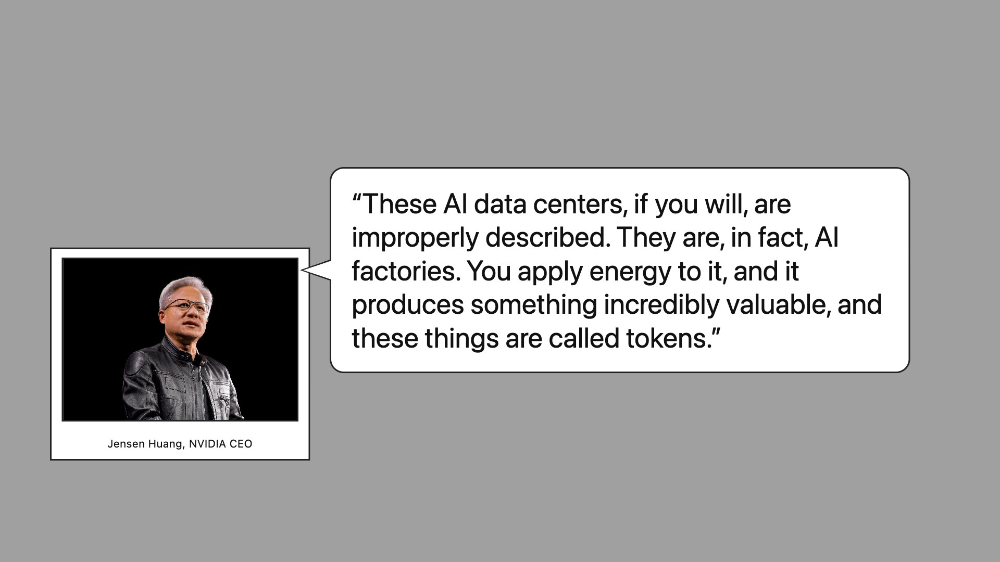
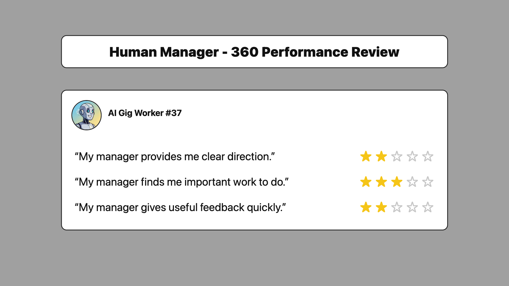
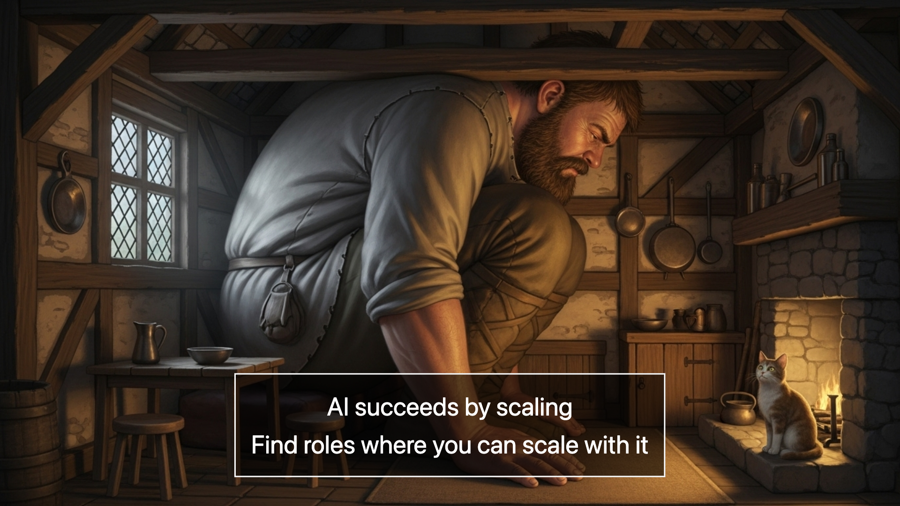

# Setting The Stage

# Your Newsfeed Is Flooded With AI Stories

Assuming you're not living under a rock, you're seeing alot of news about AI - market trends, model releases, data center construction, etc.  It's hard for a nonexpert to distinguish hype from reality. But also, once you use one of these models for a bit, it's hard to say that there's nothing new here.

# But What Does It Mean For ME?

Instead of getting long term investment advice, the question you're probably more interested in is: "What is going to happen to *my* job?" This talk is going to try to help with that in two ways.  First, to give you a mental model to think about what's happening and where it's going.  Second, do give you some concrete practices to get you started working with AI.

# What Actually *Is* Your Job Anyway?

Let's start not with AI, but with trying to figure out what your job actually is.  Let's assume you're an accountant or a programmer or a legal assistant or something like that.  You probably think of your job as a single thing - programming - but if we look at your calendar, I bet we'll see your time split between different things: "doing" the work (writing the code, making the spreadsheet) and "deciding" what work to do (planning, managing, strategizing).  This means your job isn't really one thing, but a bundle of different activities.

# You Really Are The Boss Of You

This pattern of work - a mix of doing and deciding - was noticed as a new pattern way back in the 1960s.  Peter Drucker saw these jobs emerging - people who weren't working with their hands in the factory but also weren't executives - and coined the term "knowledge work".

He pointed out that this style of work makes you the manager of your own one-person department - you're both the boss and the worker - because only you both understand the task and can actually do it.  That's the way we - accountants and programmers and graphic designers - have worked ever since.

But now AI is putting pressure on this bundle of doing + deciding inside a single person.

# Getting A Handle On The Future

Let's switch from thinking about your jobs to thinking about AI and how it will change our jobs and careers.  At this point, you might say "Hold on!  You just started with a bunchn of headlines about how AI is changing so fast.  How can we possibly plan for our futures?"

The answer is that we need to understand the path that AI technology is on, why it's on that path, project that into the future, and "skate to where the puck is going"

That might seem impossible, but remember that a few years ago GPT-4 was a magic technology no one had seen before.  Now, there are Google Gemini, Anthropic Claude, xAI Grok, Deepseek, Kimi, and a few others.  And they all do roughly similar things to roughly similar levels of ability.  The fact that the industry is converging in this way says that there is probably something structural driving it that we can "skate to".

# AI Isn't Magic, It's (Just) Brilliant Pattern Matching

There's a tendency to view AI as magic because of all the sci-fi stories we've read.  Viewed another way, it's just a pattern matching machine being put through and increasingly sophisticated set of schools.

It starts with being able to finish sentences - to do that you need to understand basic grammar and facts about the world.  Then it learns to play the "chat" game - in the internet documents it read "you" didn't mean "you, the AI", but here it does.

Now it's finished elementary school and it knows how to read and play well with others.  Now it needs to get better.  First, we have it write essays and have the (human) teacher tell it which essays are good and bad.  Second, for areas like math and logic and programming where we can make up easy-to-grade questions, we have have it take quizzes over and over.

That's actually all it is.  And that's the "convergence" - If there is a skill that we can teach and test at scale with humans, then we can train the AI to do it, as long at it is economically valuable.  It makes input-output machines that can mimic these human skills.

# Industrial-Scale Cognition

Once we see that it's an input-output machine - ask Jensen Huang puts it a "cognitive factory" or an "AI factory" - then we should be asking how we can get the most out of it.

However, the kinds of outputs that AI makes - documents, images, etc - are different.  Every iPhone is exactly like every other iPhone - it's supposed to be!  But every document is supposed to be unique, to say something that the other documents didn't already say, because documents are information, and information can be copied.

How to achieve this "uniqueness at scale" is the core question.  Let's try to find a mental model of this, and then turn that insight into some specific practices.

# AI Looks Like Something Familiar, But That's a Trap

When we first encounter AI, we see it in a UI with a text box.  That makes us want to use it like we use other UIs with a text box.

We see it like Google Search, and we ask a question, and get back some answer.  That's important, but under-uses it.  The AI could return many different answers, but search is about returning the "standard" answer, not the "for me, for this specific case" answer.

We also see it like Slack (or Discord or SMS), and we have conversations with it.  Again, that's valuable - sometimes the only way to figure out what you think is to use conversations to put your thinking into words.  But once you know what you want, that's a slow way to do it.  And it makes you think of the AI like a colleague - with agency and memory and learning - rather than as a tool.

Instead, I want to suggest a different model for working with AI - AI as gig workers.  Instead of asking it questions, or chatting, you ask it to do tasks, which you specify in a brief, and you get back results.

# How Are You At Managing AI Gig Workers?

Let's connect the dots. Drucker said you're a manager-and-worker.  AI is a great worker, but not at all a manager.  This suggests that you need to become the manager.  So how are you at that?

If you're like most people - especially people who have never managed before - probably pretty terrible.  When we're both the manager assigning the task, and the worker doing the task, we can be very loose about how the task is define, what result we want back, what the priorities are, etc.  But if we give the task to someone else, we need to be much more precise and much more thoughtful in how we delegate work.

# You Still Need To Tell Them What To Do

This is probably the most important lesson to remember from this talk.  The way the AI models work, you're (mostly) getting a new AI Gig Worker every time.  That person hasn't had water cooler chats with you about the strategy, or sat in on all your meetings.  So unless you tell them what matters to you for this job, they don't know.

You can ask them to do the task anyways, and you will get an answer, but it will be the "default" answer.  "Create sample financials for a new restaurant" rather than "Create sample financials for a 7000 sq ft chinese restaurant in the boston suburbs".

The more details you put in, the more you get the "for me" answer, not the "default answer".  And once you do this a few times, you realize that you need to explain alot.  That's ok.  We have copy-paste!

# How To Write A Brief

So, how do we already work with real life contractors on places like Upwork or Fiverr?  We write a brief.

This is a short document that explains what success at the task looks like as clearly as possible.  It makes clear that this is an input-output situation - you send in the brief because what you want back is some artifact - a document, a design, etc - not some discussion or learnings or whatever.

Suppose the task is "design a logo for my company".  To get back a good answer, you should expect to include important information - the name of your company, the vibe you want, your favorite color, etc.

In AI land, this is called "prompting" or "context engineering", but you could also just think of it as "clear business communication"

# Dealing With Organizational Challenges

This "gig worker" framework also gives us a way to approach organizational challenges that come up in deploying AI.  Instead of thinking of AI as some totally novel kind of thing that needs a whole new framework, approach it as hiring a third party contractor or SaaS application to do a service and apply the same rules.

There are many examples, but let's take a few specific ones:

Hallucinations - The case of lawyers citing made up cases in legal briefs got alot of press as a "AI hallucinates" story.  What didn't get enough coverage was the "why did the human lawyers not check it?"  If they hired a low-cost outsourced legal research firm, would they have checked it?

Data privacy - This one is easier to understand - AI is trained on data, you give data to the AI to ask it a question, what does that imply.  At the same time, it's not a novel question - you give data to Google Drive and Microsoft Sharepoint - so you need to review the vendor's Data Retention and Acceptable Use policies in the same way.  The most common answer is to a) check for paid vs free plan, and b) check for opt-in / opt-out settings.

Now let's shift from how to think about AI - as a pool of gig workers - to how to get started using AI with some concrete approaches.

# Start With A Repeated Task You Already Hate

Let's get started.  As we've said, the real hard part is defining a task, so start with a task that a) you already do repeatedly, b) you can outsource part of, and c) you don't actually like doing - the job is to get ride of this.  For some people with more structured jobs, this may be easy.  For others - especially people who do a little of alot of different things - this may require some thinking.

I'm going to use my own writing of this talk as an example.

First, remember that the AI is the "do-er" not the "decider".  You can't hand off "make the presentation", or even really "make this slide" as a task - that still has too much high-level deciding work.

So let's break down the task of making a slide into different parts.  Some of them like "what is the message of the slide", I should do myself.  Others, like "make an image that conveys the idea", I should definitely *not* do myself.  Instead, I should define what is a slide - a layout and slide text, a quote, and an image - and what I want out of it "support - not convey - the message to the target audience".

That process of finding smaller tasks inside the bigger project is the key unlock, but it's also very particular to each person's specific work.  Let me give you 3 different ways to approach it that I think work for different work styles.

# Approach 1: Job Postings

If you're familiar working with contractors, that's a natural place to start.  Look at your project, and imagine you get called away, and you still need to do this task but with less of your time.  Ask yourself "who could I hire to help me finish this faster"

Describe the kind of work you want done - graphic design, editing, etc - and then the details.  The AI doesn't really care - it has all of these skills and more - but it helps you figure out what the task is clearly.

# Approach 2:  Turning Documents Into Other Documents

This one is more for people who are used to working with files that have some sort of process around them - coding, for example.

The thing to notice is that AI has a weird nonobvious superpower:  It can take one kind of document and turn it into another kind of document.  People mostly use this in silly ways - write this essay in the form of a Shakespearean sonnet - but thinking of AI as a translator helps to structure what it's doing.  A summary is a translation of a long document into a short document.  Instead of writing a document, the AI can translate an outline into prose.

In this model, the AI is like a kind of compiler.  You tell it what its input and output types are, and you give it an input, and - like "make" - it builds one from the other.  This view is also helpful when what really matters isn't the work, but the exact form or structure of the output.

# Approach 3: Chief of Staff and "Audience of One" Reports

This third approach will be more familiar to more senior executives.  As your management span of control increases, at some point it makes sense to have a "Chief of Staff" or executive assistant.  Their job isn't to make your decisions for you, but instead to give you the exact context you need at the moment of decision, so you make the right decision as efficiently as possible.

AI can be that - think of it as hiring a consultant to create a report just for you, right now.  Given materials for an upcoming meeting, instead of asking for a summary, ask for "what are the key open decisions and what do I need to ask?"

# How To Think About Your Future

We've covered how to think of AI - as gig workers needing clear briefs - and how to get started - thinking of them as help wanted, document translation, or audience-of-one reports.

Returning to the original question - what about MY job - that answers the tactics, but not necessarily the strategy.  Everyone's job is different, though, so there isn't one answer.  Instead, I want to leave you with some more strategic thoughts on how AI will affect your job over the long term - next 5 years? - to help you start preparing for it.

# Learn Some Expert Vocabulary

To delegate effectively, it helps to have the right words.  Even if you can't build a UI, knowing words like "modal" or "dropshadow" or "gradient" helps you describe what you want.  Even if you don't program, knowing what an API or a database is helps you describe a SaaS product.

Read blogs or listen to podcasts by experts in the fields you need - not so you do their job, but so that you can use their language in talking to the AI.  What you'll find it that it not only makes you better at describing what you want, it makes you better at noticing details you couldn't see until you had words for them.

# Your Path Forward: Climb the Ladder from Doer to Decider

So far, we've focused on how to use AI on the "doing" side, but what about if your role is more "deciding".  There, you can use AI to come up with strategies and frameworks and plans much faster than before.  But probably that planning was already more limited by execution than new ideas, and adding AI to plan faster will only widen that gap.  Ironically, you likely need to focus on making your plans more concrete and execution - more "doing" - instead, and use AI to do that.

You can "prototype" your ideas with AI - not just "we should change our website messaging" but "I had the AI read the pages on our current website and here are the ones that need to change".

# The Long-Term Catch: AI Needs Scale to Matter

I want to end with a not so obvious consequence: using AI effectively requires your role to be able to scale. Let's say you use AI to become 3x more productive at customer support for a local toy store. The store won't sell 3x more toys; they'll just need 1/3 of the support staff. But if you work for a company whose business *is* customer support, that 3x efficiency is fuel for growth by taking market share from competitors. Increasingly, AI is going to force us all to think about scale much more than we ever have before, and that may change the kinds of organizational structures that make sense.  Instead of being the one accountant at a company, you might end up as a fractional accountant working with 5 companies instead.
